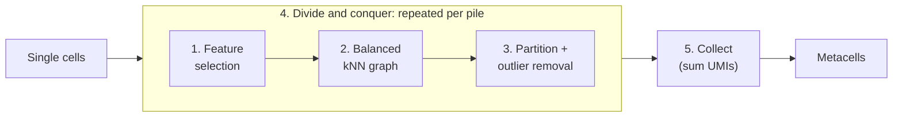
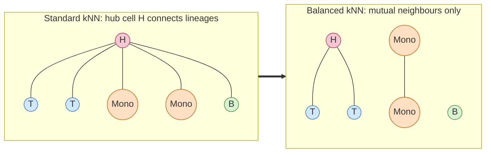
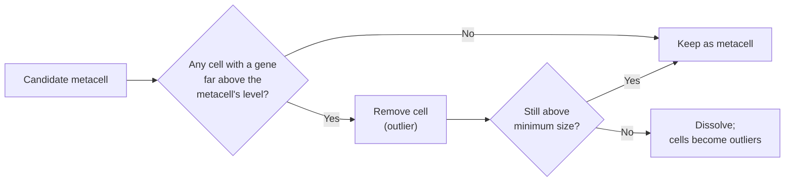
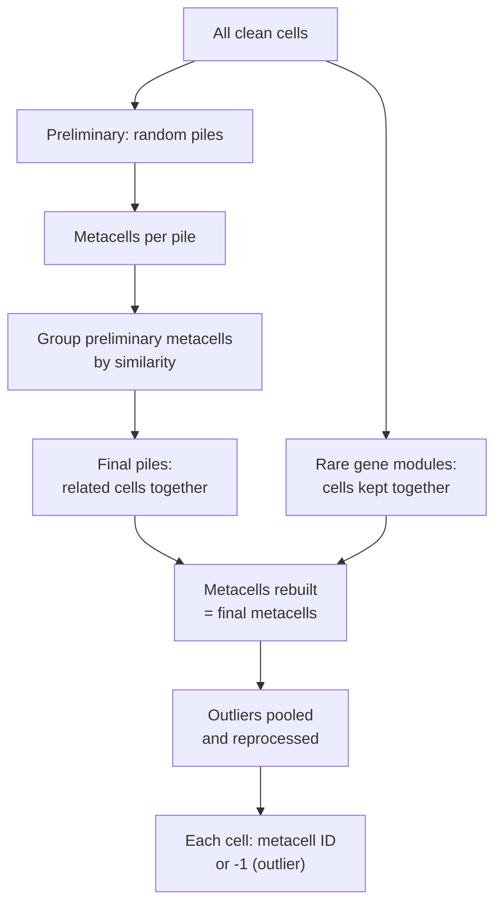

  <small><em>Author: Saumya Pothukuchi & Claude AI - Opus 4.8 (Anthropic, 2026)</em></small>

# What a metacell is

## The problem

A droplet gives a few thousand UMIs from a cell holding a few hundred thousand
mRNA molecules. Most genes in most cells read zero, and a zero does not
distinguish "off" from "expressed, not sampled".

What the data does have is redundancy. In 250,000 PBMCs there are not 250,000
distinct transcriptional states, but a few thousand, each
represented by tens to hundreds of cells that differ from each other by
sampling noise. Identify those groups, sum their counts, and the result is one
deep profile per state instead of many shallow ones.

That is a metacell: a group of cells whose differences are consistent with
being independent draws from the same distribution.

## Metacell versus a Cluster

Confusing the two causes mistakes.

**A cluster** 
* is meant to be a cell type or state.
* There are usually approximately 10 to 30.
* Each cluster holds cells that genuinely differ from each other, and how much difference is
acceptable is a resolution parameter turned by hand.

**A metacell** 
* is meant to be a sampling unit.
* There are thousands of MCs and each holds cells that are not meaningfully different, by construction, and the algorithm's job is to stop growing a group before it absorbs real variation.
* Size is set by the UMI depth needed, not by the number of expected cell types.
* This means at a global level a dataset would have one B cell cluster via traditional analysis approach, but with MetaCells, there could hundreds of thousands of B cell MCs (formed by pooling individual B cells).

Metacells are therefore upstream of clustering. MetaCells are grouped into
"blocks" afterwards ([07](07_annotation.md)), which imitates a more traditional cluster, so all the B cells MCs are pooled into one B cell MC "block", which are what get anntoated.

## How MC2 builds them

[Metacell-2](https://doi.org/10.1186/s13059-022-02667-1) (MC2) turns a cells x genes UMI matrix into a metacells x genes UMI matrix. Every step below follows one rule: **only group cells whose differences look like sampling noise.**

Steps 1 to 3 build metacells within a pile of cells. Step 4 applies them across the full dataset. Step 5 produces the output.

**1. Feature selection.**
* Equivalent to HVG selection: keep genes that vary across cells more than technical sampling alone would explain.
* Genes expressed uniformly (e.g. *ACTB*) are not selected; genes that separate populations (e.g. *CD8A*, *CD14*) are.
* **Lateral genes** are a user-defined list of genes blocked from selection even if they vary, typically cell cycle, interferon response and stress genes. They remain in the final metacell counts but do not influence which cells are grouped. Without this, cycling CD4 and CD8 T cells could pool together on proliferation genes alone.
* **Excluded genes** are removed entirely (e.g. mitochondrial, ribosomal, other technical artefacts).
* Features are re-selected within each pile (step 4), so each pile uses the genes most informative for the cells it contains.
* Single cells get pooled into MetaCells based on these genes, so arguably the weight of the features that get selected is even heavier than in a traditional workflow, hence why MC2 allows for a very detailed gene selection approach discussed in more detail later on: [05](05_gene_lists.md)

**2. Similarity graph.**
* Equivalent to `FindNeighbors`: a kNN graph of cells built on the selected features.
* Cells are downsampled to a common UMI total before comparison, so differences in sequencing depth are not mistaken for biological differences.
* **Balanced** kNN differs from a standard kNN in one way: an edge is kept only if both cells rank each other as close neighbours, and the number of edges per cell is capped.
* This prevents hub cells, cells with an intermediate profile that appear in many neighbourhoods and would otherwise connect unrelated populations.

**3. Partition.**
* Equivalent to `FindClusters`, but with a size target instead of a resolution parameter: each group aims for a set number of cells (`TARGET_METACELL_SIZE`, e.g, 72) and a set total UMI count (`TARGET_METACELL_UMIS`, e.g, 240,000).
* Because the UMI target applies alongside the cell target, metacells of low-depth cells (low UMI) contain more cells than metacells of high-depth cells (more UMI). The aim is comparable depth per metacell.
* **Outlier removal** is the step with no traditional equivalent. Each cell is compared to its candidate metacell; if it expresses any gene far above the metacell's level, it is removed.
  * Example: a candidate of naive CD4 T cells where one cell clearly expresses *MZBI* (potential doublet). That cell is removed rather than averaged in.
* Removed cells are marked **outliers** (`metacell = -1`) rather than reassigned or forced into MCs. Candidates that fall below minimum size after removal are dissolved.
* Outliers include doublets, rare states and transitional cells, so they are not necessarily low quality.
* Per-sample outlier fractions are reported in the QC workbook, and if need be manual override is possible to retain them (in case there is a sound/detailed justification), however this is not considered good practice and is not supported by the offical docs either.

**4. Divide and conquer.**
* Building a single kNN graph over 250,000 cells at this level of detail is too memory-intensive, so cells are split into **piles** (about 7,200 cells each here) and steps 1 to 3 run within each pile.
* Random piles alone would separate similar cells, so MC2 runs in phases:
  * **Rare gene modules.** Cells sharing a rare, strongly co-expressed gene program are identified first and kept together, so rare populations are not split across piles.
  * **Preliminary phase.** Cells are assigned to random piles and metacells are built within each.
  * **Final phase.** Preliminary metacells are grouped by similarity, and each group defines a new pile containing related cells from across the dataset. Metacells are rebuilt within these piles.
  * **Outlier phase.** Outliers from all piles are pooled and processed again, giving rare cells a chance to form metacells with similar cells from other piles.
* By the final phase, piles reflect biological similarity, so pile boundaries do not carry into the output.
* The preliminary phase is random, so results depend on the random seed; fix it (e.g, `RANDOM_SEED = 123`) for reproducibility.

**5. Collect.**
* Raw UMI counts are summed across member cells for every gene (lateral genes included; excluded genes removed).
* Outputs:
  * `metacells.h5ad`: one row per metacell, with cell count and total UMIs.
  * `clean_cells.h5ad`: one row per cell, with its metacell assignment (`-1` for outliers) and the lateral/noisy/rare gene masks used downstream.
* This addresses the dropout problem from the top of this page. A gene making up 1 in 10,000 transcripts is usually undetected in a single cell at ~3,000 UMIs, but expected at around 24 UMIs in a metacell at 240,000 UMIs. A zero in a metacell is therefore far more likely to reflect true absence.
* **Caveats:**
  * A metacell is an average; within-metacell variation is technical by design, so cell-to-cell heterogeneity questions should go back to single cells. This is why if a dataset is heterogenous to begin with in terms of known technical variability, a lot of false conclusions can be associated with biological variability instead.
  * MC2 does not use sample labels, so a metacell can contain cells from multiple samples or timepoints.
  * Metacells from the same donor are not independent replicates. Treating each metacell as a sample in statistical testing inflates significance.

### Parameters that shape the output

| Parameter | Value here | Increasing it gives |
|---|---|---|
| `TARGET_METACELL_SIZE` | 72 | Fewer, larger metacells; deeper profiles, higher risk of merging distinct states |
| `TARGET_METACELL_UMIS` | 240,000 | Same direction, set by depth rather than cell count |
| `TARGET_METACELLS_IN_PILE` | 100 | Larger piles; more context per pile, more memory |
| `MIN_PILE` / `MAX_PILE` | 2,000 / 16,000 | Bounds on pile size |
| `RANDOM_SEED` | 123 | Different preliminary piles; fix for reproducibility |

## Note

1. **Cells cannot be counted by counting metacells.** MC2 sizes metacells to a
target cell count, so the number of metacells in a population is not
proportional to that population's abundance. Every composition analysis here
counts cells, each carrying its metacell's label. Counting metacells would be
wrong, and wrong invisibly. See [09](09_composition.md).

2. **Outliers are real data.** Typically 5 to 10 percent of cells end up
unassigned. A rising outlier rate on a subset usually means
`target_metacell_size` is too large for how much structure is left, which makes
it a diagnostic rather than a nuisance.

## When it is the wrong tool

Metacells help when there are many cells, shallow coverage, and a question
about gene-level detail. They do not help with few cells, with questions about
individual cells, or datasets that may have technical variability.

For differential expression, pseudobulk is required regardless, because the
replicate is the donor and not the cell ([10](10_differential_expression.md)).
