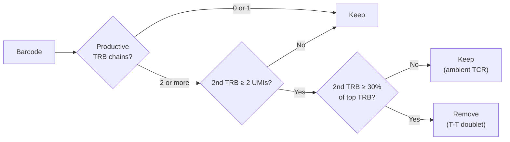

<div align="right">
  <small><em>Author: Saumya Pothukuchi & Claude AI - Opus 4.8 (Anthropic, 2026)</em></small>
</div>

# Preprocessing

Step 01 (`scripts/01_preprocess.py`) is not metacell-specific. It loads and cleans each sample, then merges them into the single object that step 02 runs on.

## Duplicated gene symbols

* Cell Ranger references contain some gene symbols that map to more than one gene ID. On loading, these become separate columns (e.g. `GeneA`, `GeneA.1`, `GeneA.2`).
* Left as is, a cell's counts for that gene are split across columns. Per-gene totals are underestimated, and one copy can pass a filter or be selected as a feature while another does not.
* Step 01 sums the duplicated columns into one and keeps the first copy's metadata.
* This runs before anything else, since every filter and total downstream depends on it. The check afterwards prints an empty vector per sample when it has worked.

## Doublets

**Is doublet filtering needed before MC2?**
* Opinions differ on whether MC2 needs traditional pre-filtering at all (doublet removal, UMI/gene count cut-offs, etc.).
* MC2 pools similar cells very effectively, so doublets tend to form their own metacells, and later their own blocks. Many users identify and remove these after metacell generation instead, typically as metacells co-expressing markers of two lineages.
* The current trend in the developing field is to leave the data as untouched as possible before metacell generation. Some datasets still benefit from pre-filtering; PBMCs are generally clean.
* Pre-filtering is therefore a personal choice, and step 01 offers two methods - traditional package based (Scrublet), and TCR-based. They catch different kinds of doublets:

| Doublet type | Example | Scrublet | TCR-based |
|---|---|---|---|
| Heterotypic | T cell + monocyte | Detects | Detects only if a TCR is recovered |
| Homotypic T-T | Two T cells | Misses | Detects (based on beta chain expression) |
| Homotypic non-T | Two B cells | Misses | Misses |
| Heterotypic non-T | B cell + monocyte | Detects | Misses |

### Expression-based (Scrublet)

* Simulates artificial doublets by combining pairs of real cell profiles, then scores each barcode by how closely it resembles those simulations.
* Available behind `RUN_SCRUBLET`, off by default.
* **Limitation:** a doublet of two cells of the same type looks like a single cell of that type with more UMIs, so homotypic doublets are invisible to it. In a T cell-dominated PBMC sample, most doublets are homotypic.
* Other traditional drawbacks also still apply, like Scrublet being potentially more stringent on proliferative populations.

### V(D)J-based (dual productive TRB)

This is what step 01 runs by default. TCR-based filtering can also be modified to be applied at subset level, since the logic will be the same regardless of what level it is applied at, however the workflow is structured this way to run the step once universally instead of multiple times.

**Why it works**
* A 10x barcode marks a droplet (GEM), not a cell, and the gene expression and V(D)J libraries share that barcode ([Zheng et al. 2017](https://doi.org/10.1038/ncomms14049)).
* TCR beta allelic exclusion is near-complete, so a T cell expresses one productive beta chain ([Brady et al. 2010](https://doi.org/10.4049/jimmunol.1001158)).
* Two distinct productive beta chains on one barcode therefore mean two T cells in one droplet.
* This is a direct observation about the droplet, not an inference from expression, which is why it catches the homotypic T-T doublets Scrublet misses. It follows the same principle as the multichain category in [scirpy's chain QC](https://doi.org/10.1093/bioinformatics/btaa611).

**Why alpha is not used**
* TCR alpha allelic exclusion is leaky: 10 to 30 percent of genuine T cells carry two productive alpha chains ([Padovan et al. 1993](https://doi.org/10.1126/science.8493531); reviewed in [Schuldt and Binstadt 2019](https://doi.org/10.4049/jimmunol.1801430)).
* Filtering on dual alpha would discard real cells at scale. The script counts and reports these cells but keeps them.

**Filtering out ambient TCR**
* mRNA released from lysed T cells can be assembled into low-support TCR contigs on unrelated barcodes ([Young and Behjati 2020](https://doi.org/10.1093/gigascience/giaa151); [Fleming et al. 2023](https://doi.org/10.1038/s41592-023-01943-7)).
* To avoid calling these as doublets, the second beta chain must pass two thresholds, set in `config/config.yaml`:

```yaml
min_second_beta_umis: 2      # absolute UMI floor
min_second_beta_frac: 0.30   # and at least 30% of the top-ranked TRB
```

* **Example:** a barcode whose top TRB has 40 UMIs.
  * Second TRB with 3 UMIs: passes the floor, but is only 7.5% of the top chain, so it is treated as ambient and the cell is kept.
  * Second TRB with 15 UMIs: passes both thresholds (37.5%), so the barcode is called a doublet.
* Raising either threshold makes the filter more conservative: fewer ambient false positives, but fewer true doublets caught.



### Note

* This removes only doublets where at least one partner is a T cell and a TCR was recovered. It complements expression-based calling rather than replacing it, and there are plenty benchmarking papers that recommend using both ([Xi and Li 2021](https://doi.org/10.1016/j.cels.2020.11.008); [Heumos et al. 2023](https://doi.org/10.1038/s41576-023-00586-w)), however again this is a personal informed decision, and both approaches are currently seen as valid for Metacell. If choosing to not employ expression based filtering (like Scrublet), then downstream analysis needs to account for these.
* The script prints a sanity check against the 10x expected multiplet rate (roughly 0.8% per 1,000 recovered cells). The observed TCR-doublet rate should sit well below this, since only T cell-containing doublets with a recovered TCR are detectable.

> [!WARNING]
> Doublet filtering changes the cell counts that every composition frequency is calculated from. If conclusions rest on exact cell counts or proportions, consider enabling Scrublet as well. Decide which filters to use early, apply them consistently, and state them in methods.

## Design metadata

* All sample-level metadata comes from `config/samples.csv`, joined to cells on `sample_origin`. Nothing is parsed from the sample ID string.
* One row per sample:

| sample_origin | patient_id | timepoint | timepoint_days | category | condition | category_plot |
|:--|:--|:--|:--|:--|:--|:--|
| P01T1 | P01 | T1 | 0 | CTRL1 | CTRL | CTRL1_T1 |

* **Why a join instead of parsing IDs:** parsing relies on every sample following the same naming pattern, and the pattern and lookup tables have to be edited inside the script for each new dataset. A join keeps all design information in one editable table, and a sample missing from it raises an error rather than being assigned the wrong metadata.
* The V(D)J library map is a separate CSV for the same reason: V(D)J folder names often cannot be derived from sample IDs, particularly when visit numbering differs between donors.

## QC output

One workbook, written by step 01 and appended to by step 02:

| Sheet | Written by | Contents |
|:--|:--|:--|
| `preprocess_qc_summary` | 01 | Per sample, plus a total row: cells and genes loaded, UMI statistics, TCR recovery, doublets removed, retention |
| `umi_percentiles` | 01 | Full UMI distribution per sample |
| `excluded_per_sample` | 02 | Cells lost at each filter, plus metacell outlier rate |

* **Check retention across samples first**, in both `preprocess_qc_summary` (doublet removal) and `excluded_per_sample` (cell QC and outliers).
* A sample losing far more cells than the others needs explaining before moving on, since every proportion downstream inherits the difference.
* Not every difference is a technical batch effect. The TCR-doublet rate rises with the number of cells loaded and with the fraction of T cells in the sample, so compare it against `n_cells_loaded` and T cell content before calling it a problem.
