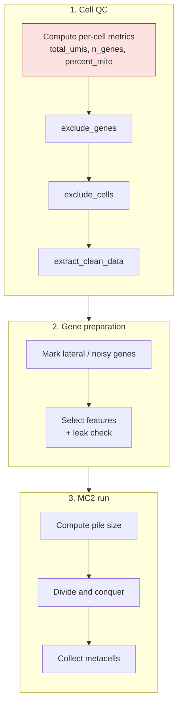

<div align="right">
  <small><em>Author: Saumya Pothukuchi & Claude AI - Opus 4.8 (Anthropic, 2026)</em></small>
</div>

# Building metacells

* Step 01 produced one merged, (optionally) doublet-filtered object with all samples ([03](03_preprocessing.md)).
* This page covers what happens next: turning that object into metacells.
* Metacells are built twice in this pipeline, with the same machinery:
  * **Script 02** (`scripts/02_global_metacells.ipynb`) runs on the whole dataset to resolve broad lineages.
  * **Script 04** (`scripts/04_subset_metacells.ipynb`) runs again on one lineage at a time to resolve finer states.
* This page covers the mechanics shared by both. What is specific to the second pass (subsetting, the purity gate, stripping stale fields) is in [08](08_two_passes.md).
* [02](02_metacells.md) explained *what* MC2 does conceptually. This page covers *how the scripts run it*, and the decisions made along the way.

| | Script 02 (global) | Script 04 (subset) |
|:--|:--|:--|
| **Input** | Merged object from step 01 | Global `clean_cells.h5ad` + lineage labels from step 03 |
| **Cell QC** | Yes | No, cells were already filtered in 02 |
| **Output** | Global metacells, annotated in step 03 | Subset metacells, annotated in step 05 |

## Overview

The script runs in three stages. Each section below follows this order.

1. **Cell QC:** compute per-cell metrics, decide which cells are too low quality to use.
2. **Gene preparation:** decide which genes are removed, which are kept but blocked from grouping, and which are used to group cells.
3. **The MC2 run:** divide and conquer, then collect cells into metacells.



**Order matters at the very first step.**
* Per-cell metrics are computed **before** any gene is removed.
* `exclude_genes` removes the mitochondrial genes. If percent mito is computed afterwards, `str.startswith("MT-")` matches nothing and every cell silently reports 0% mito.

## 1. Cell QC

### Is cell filtering needed before MC2?

* As with doublets ([03](03_preprocessing.md)), opinions differ on how much a dataset should be filtered before metacell generation.
* MC2 is robust to low-quality cells in one sense: cells that do not fit any group become outliers rather than distorting a metacell. Damaged cells can also group together into their own metacells, which can be removed after annotation.
* The current trend is to filter lightly/not at all before MC2. This pipeline again keeps two methods (MAD and miQC) available but switched off.
* Whether to use the optional filters is a dataset-specific and personal opinion decision. PBMCs are generally clean; tissue digests with more damaged cells may need them.

### How MC2 filters cells

MC2 handles cell QC in three calls:
* `exclude_genes` marks genes to be removed entirely: the **excluded gene** list (mitochondrial, haemoglobin, `MALAT1`, `NEAT1`, `MTRNR2L*`). Why each is there is covered in [05](05_gene_lists.md).
* `exclude_cells` marks cells that fail the filters below.
* `extract_clean_data` creates a new object without the excluded genes and cells. Everything after this runs on the clean object.

### Mitochondrial fraction

```python
mito_mask = merged.var_names.str.startswith("MT-")
```

* The mask uses the `MT-` prefix only, without adding `MTRNR`.
* The `MTRNR2L*` genes are nuclear-encoded humanin-like pseudogenes, not mitochondrial, so counting them inflates percent mito.
* They are still on the excluded list for a different reason: they behave as ambient, stress-associated signal.
* Percent mito is reported per cell for QC and is what miQC uses if switched on. By default, mitochondrial reads act through the excluded gene fraction below.

### Default filters

**1. UMI floor.**
* `min_umi_floor: 500`, a safety net rather than the main filter.
* The upper bound is set deliberately high. Unusually high-count cells are better handled as potential doublets ([03](03_preprocessing.md)) than removed by a fixed threshold.

**2. Excluded gene fraction.**
* A cell is dropped if excluded genes make up more than `max_excluded_gene_fraction` (0.2) of its total UMIs.
* This is the filter doing the real work, and it catches three problems with one threshold:
  * **Dying cells:** high mitochondrial fraction as cytoplasmic mRNA leaks out.
  * **Ambient-dominated droplets:** high `MALAT1` / `NEAT1` relative to everything else.
  * **Red cell contamination:** high haemoglobin.
* Because it is a fraction, it scales with library size instead of acting as a fixed cutoff.

### Optional filters: MAD and miQC

Both scripts contain these, currently commented out. They are kept as alternatives for datasets that need stricter QC.

**MAD-based outlier calling.**
* Imitates Seurat's nCount_RNA filtering (although the Metacell pipline also filters based on 500 UMI floor).
* Flags cells whose UMI count or number of detected genes lies far from their own sample's median, in either direction.
* "Far" is measured in median absolute deviations (MADs), a spread measure that is not distorted by the outliers it is trying to find.
* **Why use it:** thresholds come from each sample's own distribution, so a deeply sequenced sample and a shallow one are each judged fairly, instead of one fixed cutoff being too strict for one and too lenient for the other ([Heumos et al. 2023](https://doi.org/10.1038/s41576-023-00586-w)).
* **Limitation:** it assumes most cells in a sample are typical. Populations that naturally sit at the edge of the distribution (small lymphocytes at the low end, plasma cells at the high end) can be removed as outliers.

**miQC.**
* Models the relationship between mitochondrial fraction and number of detected genes as two groups: intact cells and compromised cells. Each cell gets a probability of being compromised, and cells above a threshold (0.75 by default) are removed ([Hippen et al. 2021](https://doi.org/10.1371/journal.pcbi.1009290)).
* **Why use it:** a fixed mito cutoff ignores cell complexity. miQC flags a high mito fraction in a low-complexity cell (likely damaged) but not the same fraction in a high-complexity cell (likely a metabolically active, intact cell).
* The published package is R only; the scripts contain a Python reimplementation.
* **Limitation:** it needs enough compromised cells to model the second group. On very clean data it may not fit well.

| Filter | Catches | Default |
|:--|:--|:--|
| UMI floor | Empty or near-empty droplets | On |
| Excluded gene fraction | Dying cells, ambient droplets, red cell contamination | On |
| MAD | Cells unusual for their own sample in depth or complexity | Off |
| miQC | Damaged cells, accounting for complexity | Off |

**Why they are off here:** in this data the excluded gene fraction already removes the same cells, and stacking filters makes attrition hard to interpret.

**Switching them on:** their masks are combined into `excluded_cell`, so a cell failing any filter is removed. The attrition table already has columns for them.

> [!TIP]
> For MAD, use `nmads=5` on raw MAD units (sc-best-practices convention) or `nmads=3` on SD-equivalent units (scater convention). Avoid `normal_scale=True` with `nmads=5`: that is a band about 7.4 raw MADs wide, which no standard uses.

### Attrition

* Every cell removed is recorded per sample and per filter in `excluded_per_sample` in the QC workbook, alongside the doublet counts from step 01.
* As in [03](03_preprocessing.md), compare retention across samples before going further. A sample losing far more cells than others needs explaining before its proportions are trusted.

## 2. Gene preparation

With clean cells in hand, the next decision is which genes MC2 uses to group them.

### Lateral and noisy genes

* **Lateral genes** stay in the counts but are blocked from feature selection, so they cannot decide which cells group together (e.g. cell cycle, interferon response, stress).
* **Noisy genes** are given extra tolerance in the outlier check, since they are expressed in bursts and would otherwise make too many cells look like outliers.
* Both are set with `mc.pl.mark_lateral_genes` and `mc.pl.mark_noisy_genes`. How the lists are built is covered in [05](05_gene_lists.md), and it is the single most consequential decision in this step. 

### Feature selection
Metacell authors note that modifying lateral/noisy/excluded gene masks significantly impacts Metacell formation, and is the recommended approach over trying to tweak the actual variable gene selection step, since that is less influential or selectively biologically meaningful.

```python
selected = mc.pl.extract_selected_data(
    adata=clean, min_gene_relative_variance=None, random_seed=RANDOM_SEED)
```

* Picks the genes that vary most across cells, as described in [02](02_metacells.md).
* `min_gene_relative_variance=None` lets MC2 choose the variability cutoff from the data instead of imposing one.
* MC2 re-selects features inside each pile during the run, so this call is mainly a check. The important part is the **leak check** that follows: confirming no lateral gene was selected. Any that were should be added to the lateral list and the run repeated ([05](05_gene_lists.md)).

## 3. The MC2 run

### Divide and conquer

```python
mc.pl.compute_target_pile_size(...)
mc.pl.divide_and_conquer_pipeline(...)
```

* The algorithm itself (piles, preliminary and final phases, outlier reprocessing) is explained in [02](02_metacells.md). How to choose the size parameters is in [06](06_parameters.md).
* `compute_target_pile_size()` must run first: it writes the pile size onto the object, and the pipeline reads it from there.
* The size parameters are passed to both functions because both use them.
* Wrap the pipeline in `mc.ut.progress_bar()`. On a few hundred thousand cells it runs for hours, and the bar is the only sign it is still progressing.

**Compute resources.**
* Set the worker count from the scheduler rather than hard-coding it:

```python
n_processors = int(os.environ.get("LSB_DJOB_NUMPROC", os.cpu_count() or 4))
mc.ut.set_processors_count(n_processors)
```

* Both container definitions also set `OMP_NUM_THREADS=1`, so linear algebra libraries do not start their own threads on top of MC2's parallelism and overload the node.

### Collect

```python
metacells = mc.pl.collect_metacells(clean, name="...", random_seed=RANDOM_SEED)
```

* Sums each metacell's member cells into one profile and writes the metacell object.
* Also assigns every cell in the clean object its metacell, or `-1` if it is an outlier.

### Outliers

The run prints a summary:

```
Metacells: 6367 | outlier cells: 12841 (5.05%)
```

* **5 to 10% is typical.**
* The rate usually rises on a subset: the population is more homogeneous, so there is less signal to separate cells on.
* Above roughly 10% on a subset suggests `target_metacell_size` is too large for the structure remaining ([06](06_parameters.md)).
* Outliers are added per sample to `excluded_per_sample`. A sample with a much higher rate than the others needs explaining. It can be technical (a batch or quality issue), or biological (a population unique to that sample with too few cells to form metacells).

### Rare gene modules

* Before splitting cells into piles, MC2 looks for modules of genes expressed at high levels in a very small fraction of cells, and keeps those cells together ([02](02_metacells.md)). This is how genuinely rare populations survive a process that would otherwise absorb them into larger metacells.
* Both scripts extract these modules and write them to the QC workbook, for two reasons:
  * **They identify rare cell types.**
  * **They flag gaps in the lateral list.** A rare module made of immunoglobulin or stress genes means those genes should probably have been lateral.

> [!WARNING]
> The rare gene detector considers at most 500 candidate genes. If contaminant genes fill that cap, the genes that would have separated a real rare population are never considered. Script 04 checks whether the cap is being hit:
>
> ```python
> candidate = (n_expressing / n < 0.001) & (gene_max >= 7)
> print(f"candidate rare genes: {int(candidate.sum())} (cap is 500)")
> ```
>
> If the count is under 500, this is not a concern.

* Script 04 also cross-tabulates rare modules against global block and label. A module driven by contamination from one block can then be traced, and those cells dropped before the subset is rebuilt if needed.
* On a subset, an empty rare-module result is common and expected: the rare populations the global run detected (e.g. pDCs, platelets, plasma cells) are no longer in the object.

## What gets written

| File | Contents | Read by |
|:--|:--|:--|
| `*.clean_cells.h5ad` | Per-cell object: metacell assignment plus the `lateral_gene` / `noisy_gene` / `rare_gene` masks | Scripts 03 / 05 (gene masks), script 04 (global run only, as subset input) |
| `*.metacells.h5ad` | Collected metacell object, one row per metacell | Scripts 03 / 05 |
| QC workbook, `excluded_per_sample` | Per-sample attrition through each filter, plus outlier rate | Manual review |

* The gene masks on the cell object are what let scripts 03 and 05 keep lateral genes out of the module HVG selection ([07](07_annotation.md)).
* Printed diagnostics from this step, and what to do when they look wrong, are collected in [13](13_diagnostics.md).
