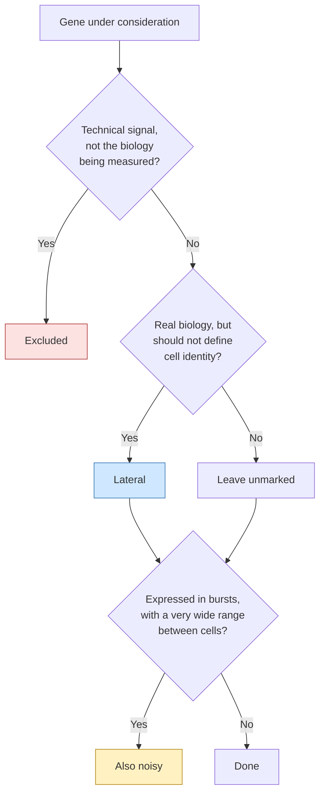

<div align="right">
  <small><em>Author: Saumya Pothukuchi & Claude AI - Opus 4.8 (Anthropic, 2026)</em></small>
</div>

# Gene lists

* In a traditional workflow, genes are either in the analysis or removed. Some pipelines also drop specific genes from the HVG list (e.g. TCR genes) or regress out cell cycle (e.g, removing IG genes before HVG selection: [Kethidi, N., Pothukuchi, S., et al](https://pubmed.ncbi.nlm.nih.gov/42778764/)).
* MC2 makes these decisions explicit through three separate gene lists: **excluded**, **lateral** and **noisy**. Each changes a different part of how metacells are built ([02](02_metacells.md)).
* Because metacells are built entirely on the genes MC2 is allowed to use, these lists shape the output more than any single parameter. Putting a gene on the wrong list, or leaving it off, is the most common way to get metacells that look fine and are not.
* The lists are applied in scripts 02 and 04 ([04](04_building_metacells.md)): excluded genes during cell QC, lateral and noisy genes just before feature selection.

## What each list does

| | Excluded | Lateral | Noisy | Unmarked |
|:--|:--|:--|:--|:--|
| Present in the output | No | Yes | Yes | Yes |
| Counted in cell totals | No | Yes | Yes | Yes |
| Used to group cells | No | No | Yes (unless also lateral) | Yes |
| Can make a cell an outlier | No | Yes | Only at a higher threshold | Yes |
| Traditional equivalent | Removing the gene | Keeping it out of HVGs, but keeping it in the data | None | Normal gene |

Choosing a list:



Lateral and noisy are independent flags. A gene can be one, both, or neither.

## Excluded

Genes removed from the object entirely: not counted, not used for grouping, not present downstream. This list is for signal that does not reflect the biology being measured.

| Genes | Why excluded |
|:--|:--|
| Mitochondrial (`^MT-`) | A high mito fraction is a QC signal, not a cell state. Left in, dying cells from every lineage group together. |
| `MALAT1`, `NEAT1` | Nuclear lncRNAs whose counts mainly reflect how much nucleus was captured in the droplet |
| Haemoglobin (`HBB`, `HBA1`, `HBA2`, `HBD`, `HBM`) | Ambient RNA from lysed red cells, present at some level in nearly every PBMC droplet |
| `MTRNR2L*` | Nuclear-encoded humanin-like pseudogenes, similar in sequence to mitochondrial `MT-RNR2` and highly expressed in stressed cells |

> [!WARNING]
> Do not use the pattern `MT1.*` for mitochondrial genes. It matches the metallothioneins `MT1A`, `MT1X` and `MT2A`, which are real stress-response genes. Use `^MT-`, with the hyphen.

**Subset runs only.** Script 04 also excludes genes with zero UMIs across the subset. They carry no information within that lineage, and they destabilise the variance fit used for module gene selection in script 05.

**Exclusion changes cell totals.** Cell UMI totals are computed after exclusion, and these totals are what `target_metacell_umis` is compared against. When setting that parameter ([06](06_parameters.md)), use post-exclusion totals.

## Lateral

Genes that stay in the counts and in outlier detection, but are not used to decide which cells group together.

* A lateral gene is **real biology that should not define cell identity**.
* Cell cycle is the classic example. A proliferating CD8 T cell and a proliferating plasmablast share a strong cell-cycle program. If those genes drive grouping, the result can be a "cycling" metacell containing both lineages.
* Marking them lateral keeps proliferation measurable in the output (e.g. *MKI67* is still quantified in every metacell) while stopping it from pulling lineages together.

| Group | Examples | Why lateral |
|:--|:--|:--|
| Cell cycle, S and G2M ([Tirosh et al. 2016](https://doi.org/10.1126/science.aad0501)) | `MKI67`, `TOP2A`, `PCNA` | Shared across every proliferating lineage |
| Stress and immediate-early | `FOS`, `JUN`, `EGR1`, `HSPA*`, `HSPB*`, `DNAJB1` | Largely a dissociation artefact ([van den Brink et al. 2017](https://doi.org/10.1038/nmeth.4437); [O'Flanagan et al. 2019](https://doi.org/10.1186/s13059-019-1830-0)) |
| Sex-linked | `XIST`, `RPS4Y1`, `DDX3Y` | Would split every cell type by donor sex |
| Platelet and megakaryocyte | `PPBP`, `PF4`, `ITGA2B` | Ambient RNA from platelet contamination |
| HLA class I and II | `HLA-A`, `HLA-DRB1`, `HLA-DQA1` | Varies with activation state and donor genotype, not identity |
| Ribosomal | `^RPS`, `^RPL`, `^RPP` | Tracks library size and translational state |
| TCR V, D and J segments | `TRAV`, `TRBV`, `TRGV`, `TRDV`, `TRAJ`, `TRBJ`, `TRDJ`, `TRBD`, `TRDD` | See below |
| Immunoglobulin V and J segments, `JCHAIN` | `IGHV`, `IGKV`, `IGLV`, `IGHJ` | Same reasoning as TCR, for B cell clones |

The full lists are in scripts 02 and 04.

### The V(D)J segments

* The variable segments of the TCR and BCR are shared by every cell in a clone, and differ between clones.
* If they are used for grouping, cells start grouping by **clone** rather than by **state**. A metacell can then turn out to be one expanded clone rather than a cell state.
* This matters more on a T cell subset than globally. Across the whole dataset, differences between lineages are far larger than differences between clones. Within one lineage, clonal differences become one of the largest signals left, and they are the wrong one.
* The constant regions `TRAC`, `TRBC1` and `TRBC2` are kept unmarked: they are shared across all clones and are useful lineage markers. The same logic underlies [scRepertoire's `quietTCRgenes`](https://doi.org/10.1093/bfgp/elac049).

* ### Refining the list from rare gene modules

* The lateral list is not final after the first run. The rare gene module printout from scripts 02 and 04 ([04](04_building_metacells.md)) is the best place to find genes that should have been on it.
* A rare module should contain genes marking a genuinely rare population (e.g. pDCs). Sometimes it contains genes that are not rare biology but slipped through the lateral list (e.g. an unmarked constant region such as `IGKC`) spreading as ambient RNA or contamination.
* **Fix:** add the gene to the lateral list and rerun. The rare gene modules should then contain only genes that define real rare populations.
* Before marking a gene lateral this way, check which cells carry the module (script 04 cross-tabulates modules against global block and label). If the module sits cleanly in one population that should be there, it may be real biology and should stay unmarked.

## Noisy

Genes given extra tolerance in outlier detection, because they are expressed in bursts.

* Recall from [02](02_metacells.md) that MC2 removes a cell from a metacell if any gene is far above the metacell's level. For bursty genes, that happens to genuinely matching cells.
* Immunoglobulin genes are the clearest case. A plasma cell's `IGHG1` count can be around 100-fold higher than a neighbouring plasma cell's without either being anything other than a plasma cell. Without the noisy flag, many would be removed as outliers.
* Noisy is independent of lateral. A noisy gene that is not lateral (e.g. `IGHG1`) still contributes to grouping; it just cannot make a cell an outlier on its own.

| Group | Examples |
|:--|:--|
| Immunoglobulin constant regions | `IGHM*`, `IGHA*`, `IGHG*` |
| Immunoglobulin V and J segments, `JCHAIN` | `IGHV`, `IGKV`, `IGLV` |
| Stress and immediate-early | Same genes as the lateral stress group |
| High-dynamic-range HLA | `HLA-A`, `HLA-B`, `HLA-C`, `HLA-E`, `HLA-DRB1`, `HLA-DQA1`, `HLA-DQB1` |

The overlap with the lateral list is intentional; the two flags do not conflict.

## The check that catches mistakes

After feature selection, scripts 02 and 04 both run:

```python
leaked = clean.var_names[clean.var["selected_gene"] & clean.var["lateral_gene"]]
```

* This should be **empty**.
* A lateral gene in the selection means the lateral marking did not take effect, usually because it was applied to the wrong object or after selection had already run.
* A leaked gene, cell cycle especially, visibly degrades the metacells. Fix the marking, rerun.

Script 04 adds a stricter check for the subset case, printing any selected gene matching `TR[ABGD][VJD]`. On a T cell subset, anything printed here means stop and fix before continuing, not a warning to note.

The same step also reports how many feature genes were selected. On a subset this is expected to be well below the global count, since differences between lineages are gone; a very low count (roughly under 200) leaves too little signal to build good metacells and needs fixing upstream.

> [!TIP]
> Marking a gene lateral is cheap and reversible: it stays in the data and can be unmarked on the next run. Excluding a gene is not, because it changes every cell's total. When unsure which list a gene belongs on, lateral is almost always the safer choice.
