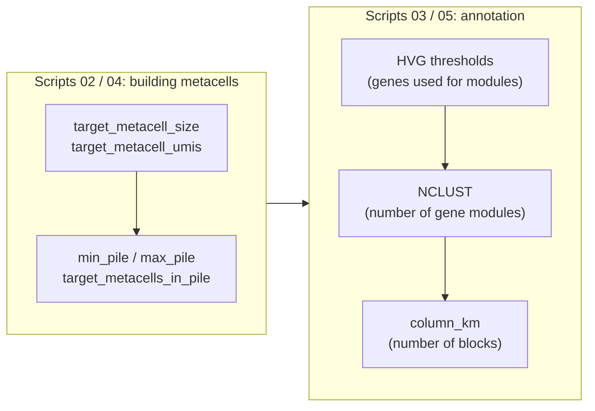
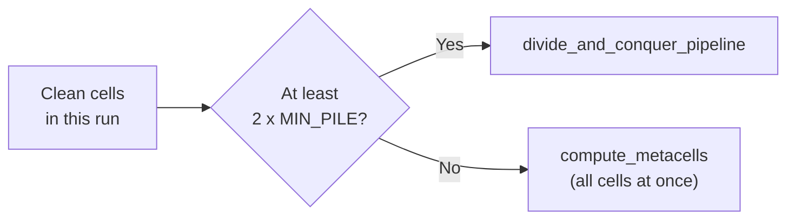
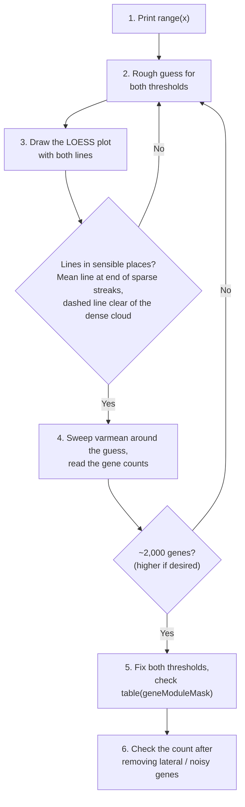

<div align="right">
  <small><em>Author: Saumya Pothukuchi & Claude AI - Opus 4.8 (Anthropic, 2026)</em></small>
</div>

# Choosing parameters

* [04](04_building_metacells.md) covered how the scripts run MC2, and [05](05_gene_lists.md) covered which genes it uses. This page covers the numbers: how big metacells should be, and how finely the annotation steps split them afterwards.
* Parameters are of two kind:
  * **MC2 parameters** (metacell size, UMI target, piles) are in `config/config.yaml` and used by scripts 02 and 04.
  * **Annotation parameters** (module count, HVG thresholds, number of blocks) are set at the top of scripts 03 and 05, because they are tuned while looking at a diagnostic printed in that same script.
* Almost every parameter needs re-tuning between the global run and each subset. The summary table at the end lists which, and what to read before changing each.



Each parameter depends on the ones before it, so tune them in this order.

## 1. Metacell size: `target_metacell_size`

**What it is.**
* The number of cells MC2 aims to put in each metacell.
* The resulting cells-per-metacell is called the **graining level**, gamma (γ). A gamma of 30 means each metacell pools about 30 cells.
* This is the most consequential choice in the pipeline, closest in spirit to choosing a clustering resolution, but in the opposite direction: larger metacells mean fewer, coarser units.

**What range is safe.**
* [Bilous et al. 2022](https://doi.org/10.1186/s12859-022-04861-1) benchmarked graining levels between 10 and 50. In that range, over 75% of differentially expressed genes found at the single-cell level were still recovered from metacells.
* They did not test above 50, so >50 range lacks evidence currently, however this field is rapidly developing and ultimately these numbers are not set in stone and only serve as a reference. Some datasets may need a >50, however those seem to be extremely rare.

| Smaller gamma (roughly 15 to 25) | Larger gamma (roughly 35 to 50) |
|:--|:--|
| More metacells, finer structure | Fewer metacells, each deeper |
| Rare states survive as their own metacells | Rare states risk being absorbed into neighbours |
| Noisier per-metacell profiles | Cleaner profiles, more stable module scores |
| Slower downstream steps | Faster downstream steps |

**The target is not what you get.**
* MC2 treats `target_metacell_size` as a guide, and the UMI target (next section) can stop a metacell from growing before it reaches it.
* Always check the **realized** gamma after a run: cells placed in metacells divided by the number of metacells. Script 04 prints it as `mean cells per metacell`.

| Run | Target size | Target UMIs | Cells in metacells | Metacells | Realized gamma |
|:--|:--|:--|:--|:--|:--|
| Global | 72 | 240,000 | 241,359 | 6,902 | ~35 |
| T cell subset | 24 | 160,000 | 108,390 | 6,131 | ~17.7 |

* The realized value is what Bilous et al. benchmarked, so this is the number to hold against the 10 to 50 range. The global target of 72 looks too large on paper, but the run lands at ~35 because the UMI target stops metacells growing first.

## 2. UMI target: `target_metacell_umis`

**What it is.**
* The total UMI count MC2 aims for per metacell.
* A metacell stops growing when it reaches **either** target. Whichever is reached first is the one actually controlling metacell size.

**Setting the two together.**
* The rough relationship between them is:

```
cells per metacell  ≈  target_metacell_umis / median UMIs per cell
```

* If `target_metacell_umis` is well above `target_metacell_size x median UMIs`, the cell target is reached first, and metacells come out close to the requested size.
* If it is well below, the UMI target is reached first, and metacells come out smaller than the requested size. This is what happened in the global run: 240,000 UMIs is reached at around 35 to 40 typical cells, well before 72.
* Neither case is wrong. What matters is knowing which target is in control, so the realized gamma still falls in the desired range.

**Script 04 prints the calculation for each subset** on the subset's own cells. For the T cell subset:

```
n_cells=121,438  median=6,415  IQR=4,640-8,432
  size=24 -> umis=154,000
  size=36 -> umis=231,000
  size=48 -> umis=308,000
```

* Here 160,000 UMIs and 24 cells are roughly balanced (160,000 / 6,415 ≈ 25 cells), so both targets act at about the same point.
* Realized size still came out lower (17.7), because deeper-than-median cells reach the UMI target sooner, and MC2 tends to land below its targets rather than on them.

> [!WARNING]
> Set the UMI target from the subset's own printout, not from the global run's value. `total_umis` is computed after gene exclusion (mitochondrial, haemoglobin, `MALAT1` etc. already removed, [05](05_gene_lists.md)), so it is lower than raw library size, and depth also differs between lineages. Carrying the global target onto a subset without recomputing is a common way to end up with the wrong target in control.

### Depth differs by lineage

The same graining level needs a different UMI target per lineage, because library depth is not uniform across cell types:

| Lineage | Consideration | Suggested size | UMIs |
|:--|:--|:--|:--|
| T cells | Usually the largest subset | 24 to 50 | size x subset median |
| Myeloid | Deeper libraries, fewer cells | 30 to 40 | size x subset median |
| B cells | Usually the smallest subset | 24 to 32 | size x subset median |

These are starting points. Set the final value from the subset's printout, run, and check the realized gamma and outlier rate ([04](04_building_metacells.md)). An outlier rate above roughly 10% on a subset suggests the size is too large for the structure left.<br>
**Ultimately, these calculation formulas are estimates, and should not be taken as an absolute. They serve as a guide, but can be fine-tuned to fit the exact needs of the dataset regardless of whether or not the number fits these brackets.**

## 3. Piles: `min_pile`, `max_pile`, `target_metacells_in_pile`

**What they are.**
* Piles are how divide and conquer splits cells into manageable groups ([02](02_metacells.md)). The final phase regroups piles by similarity, so pile boundaries should not leave a trace in the output, but pile size still matters at the edges.
* `compute_target_pile_size()` sets the pile size from `target_metacells_in_pile` (roughly: target cells per metacell x metacells per pile), then keeps it between `min_pile` and `max_pile`.
* `target_metacells_in_pile = 100` is reasonable and rarely worth changing.

| Run | `min_pile` / `max_pile` |
|:--|:--|
| Global | 2,000 / 16,000 |
| Subsets | 8,000 / 16,000 |

**Whether to use divide and conquer at all.**
* This is the one real decision here. Script 04 decides based on cell count:

```python
use_dac = clean.n_obs >= 2 * MIN_PILE
```

* With fewer than two piles' worth of cells, it calls `compute_metacells()` directly on all cells at once. This is faster, and avoids splitting a small population into piles for no benefit.
* **Example:** with `MIN_PILE = 8000`, the switch is at 16,000 cells. The T cell subset (121,438 cells) and myeloid subset use divide and conquer; the B cell subset (around 5,700 cells) goes straight to `compute_metacells()`.
* Lowering `min_pile` forces divide and conquer on a smaller subset, if its extra steps (such as rare gene module detection) are wanted there.



## 4. HVG thresholds: `inVarMean_MeanThresh`, `inVarMean_varmeanThresh`

From here on, parameters belong to the annotation scripts (03 and 05), which work on metacells rather than cells. Annotation itself is covered in [07](07_annotation.md).

### What they do

* Equivalent to HVG selection in a traditional workflow, but on metacells: these pick the genes used to build gene modules ([07](07_annotation.md)).
* Unlike `FindVariableFeatures`, where you ask for a number of genes (e.g. `nfeatures = 2000`), here you set two thresholds on a plot and the number of genes follows from them. The thresholds are tuned until the count lands where you want it.

### Reading the plot

Script 03/05 draws one dot per gene:

* **x-axis, `log10(mean)`:** how highly the gene is expressed across metacells. MC2 scales each metacell to sum to 1, so means are tiny fractions and the log values are negative (roughly -11 to -1.5). Further right = more highly expressed.
* **y-axis, `log2(variance / mean)`:** how variable the gene is *relative to its expression level*. Raw variance is not used because it rises with expression on its own, and would just select the most abundant genes.

**The noise floor (blue LOESS curve).**
* The script splits the x-axis into narrow bins of genes with similar expression, and in each bin takes the **least variable gene** (blue dots). That gene is assumed to be not variable at all: its variation is pure sampling noise.
* A smooth curve (LOESS) is fitted through those minima. This curve is the variability expected from noise alone at each expression level.
* A gene is interesting only if it sits well above the curve.

**The two thresholds** each draw a red line:
* `inVarMean_varmeanThresh` (**dashed line**): the floor shifted up by this amount. Genes must sit above it. Because the y-axis is log2, a threshold of 3 means about 2³ = 8 times the variability expected from noise.
* `inVarMean_MeanThresh` (**dotted vertical line**): genes to its left are too lowly expressed to use, however variable they look.

Selected genes are those **above the horizontal dashed red line and right of the vertical dotted red line**.


### What each threshold changes

**Raising `inVarMean_varmeanThresh` lifts the horizontal dashed red line**, keeping only more strongly variable genes.
* Too low: the line sits close to the floor and lets in genes whose variation is barely above noise. Modules get padded with genes that do not carry a program.
* Too high: only the most extreme genes pass, and subtler programs (e.g. an activation state shared by part of a lineage) have too few genes to form a module.


**Moving `inVarMean_MeanThresh` right removes lowly expressed genes.**
* At the far left, genes are detected in only a handful of metacells. A gene seen by chance in three metacells and zero everywhere else looks extremely variable, but that variability is sampling luck, not biology.
* On the real plot these appear as sparse, streaky dots on the left edge. Place the dotted line where the streaks end and the cloud becomes continuous.
* Set too far left, these genes flood the selection (left panel below). Set too far right, genuinely informative low-expression genes (many transcription factors, some cytokines) are lost.


### Tuning them, step by step

Both thresholds are fine-tuned together, by looking at the plot and at the gene count, not set once from a formula.



**1. Read the expression range.** Script 05 prints `range(x)`, the lowest and highest `log10(mean)`. This tells you where the dotted line can sensibly go.
* Global run: -10.79 to -1.64. T cell subset: -9.84 to -1.53.

**2. Make a rough first guess.**
* Mean threshold: a little inside the lower end of the range. The global run used -9; the T cell subset -8.7.
* Varmean threshold: any reasonable starting value. It will be refined by the sweep.

**3. Look at the plot and adjust.** Draw it with both lines and ask:
* Does the dotted line sit where the sparse streaks give way to the continuous cloud? If streaks still pass on its right, move it right.
* Does the dashed line sit clear of the dense grey cloud hugging the floor? If it cuts through the cloud, raise it.
* Does the blue curve follow the bottom edge of the cloud? If it bends away sharply at either end (usually because too few genes fall in the end bins), treat selections at that end with caution.

**4. Sweep the varmean threshold.** With the mean threshold fixed, the script counts how many genes each varmean value would select:

```r
thresholds <- seq(0.5, 1.5, by = 0.05)
setNames(sapply(thresholds, n_genes), thresholds)
```


* Pick the value that lands near **2,000 genes**. More is fine if you want finer modules; the global run initially aimed for ~3,000 due to known heterogenity. Aiming for HVGs allows capture of smaller more heterogenous population.
* Adjust the sweep range to the run. The global run swept narrowly around 3.65 to 3.7 once the rough area was known; the T cell subset swept 0.5 to 1.5.
* The sweep only varies the varmean threshold. To see the effect of a different mean threshold, change it and rerun the sweep.

**5. Fix both thresholds** and check the final count with `table(geneModuleMask)`. If it has moved away from the target, go back to step 3.

**6. Check the count after lateral and noisy genes are excluded from HVG** ([05](05_gene_lists.md)). Including laternal/noisy genes in HVGs is okay, however since these genes were deemed not ideal for metacell formation, it makes little sense to include them in metacell pooling either, and helps to retain more biologically meaningful lineage markers, however leaving them in is also perfectly acceptable. The target after removal is roughly **1,500 to 2,500**, or higher based on dataset needs.

| Run | `range(x)` | Mean threshold | Varmean threshold | Genes selected | After removing lateral/noisy |
|:--|:--|:--|:--|:--|:--|
| Global | -10.79 to -1.64 | -9 | 3.67 | 2,096 | 1,986 |
| T cell subset | -9.84 to -1.53 | -8.7 | 1.3 | 2,134 | 1,981 |

### Why these must be re-tuned for every subset

> [!WARNING]
> Thresholds copied from the global run will not select a similar number of genes on a subset.

* **The x-axis shifts.** MC2 scales each metacell to sum to 1, so a gene's value depends on everything else in the object. Subsetting changes the cells and genes present, and `range(x)` moves with it.
* **The y-axis compresses.** On a subset, differences between lineages are gone, so genes vary much less overall. The T cell subset needed a varmean threshold of 1.3 against 3.67 globally to select a similar number of genes.
* So on each subset, repeat steps 1 to 6 from scratch.

### When too few genes pass

* **Below about 200 genes**, the gene-gene correlation step that builds modules stops being meaningful, and the script stops with an error.
* Lowering the thresholds further rarely fixes this. It usually points upstream: a purity gate that removed too much ([08](08_two_passes.md)), or a lateral list covering informative genes ([05](05_gene_lists.md)).

## 5. Module count: `NCLUST`

**What it is.**
* The selected genes are grouped into gene modules by clustering them on their correlation with each other. `NCLUST` is how many modules the gene tree is cut into.
* Default: 100 globally, 90 on a subset.

**What limits it.**
* Gene-gene correlations are computed across **metacells**, not cells, so how reliable they are depends on the number of metacells.
* Below roughly 200 metacells, correlations become noisy and `NCLUST` should come down with them. This matters most for small subsets.

**The check.** Script 05 prints how many modules fall into each size range:

```r
table(cut(table(res2_cut), breaks = c(0,1,3,5,10,20,Inf)))
```

* Many modules with only 1 to 3 genes means `NCLUST` is too high: the tree is being cut into fragments rather than coherent programs. Lower it to 60 to 80 and rerun.

## 6. Number of blocks: `column_km`

**What it is.**
* The number of groups the module-score heatmap is cut into. Each group is a **block**, and blocks are what get annotated ([07](07_annotation.md)).
* This is the closest thing in the pipeline to a clustering resolution parameter, and like resolution it is tuned by looking at the result.
* Default: 40 globally (on 6,902 metacells), 25 on a subset (`N_BLOCKS` in script 05).

**Why a subset needs fewer blocks.**
* Not necessarily because there are fewer metacells: the T cell subset has 6,131, close to the global count, because its target size was lowered.
* The reason is fewer distinct states. A single lineage has fewer programs to separate than the whole dataset, so 40 blocks would split real states into fragments with too few metacells each for annotation scoring to be stable.
* For small subsets (e.g. B cells), fewer metacells compounds this.

**The check.** Script 05 prints any small blocks:

```r
cat("blocks with <10 metacells:", ...)
```

If several appear, lower the block count and rerun the heatmap chunk.

## Summary

| Parameter | Global | Subset | Re-tune per subset | Read this first |
|:--|:--|:--|:--|:--|
| `target_metacell_size` | 72 | 24 | Yes | Cell count, realized gamma after the run |
| `target_metacell_umis` | 240,000 | 160,000 | Always | Subset UMI printout from script 04 |
| `target_metacells_in_pile` | 100 | 100 | Rarely | |
| `min_pile` / `max_pile` | 2,000 / 16,000 | 8,000 / 16,000 | Sometimes | Whether divide and conquer is wanted |
| `inVarMean_MeanThresh` | -9 | -8.7 | Always | `range(x)` |
| `inVarMean_varmeanThresh` | 3.67 | 1.3 | Always | Threshold sweep |
| `NCLUST` | 100 | 90 | Yes | Metacell count, module size table |
| `column_km` / `N_BLOCKS` | 40 | 25 | Yes | Blocks with fewer than 10 metacells |
| `purity_min` / `purity_other_max` | n/a | 0.3 / 0.4 | Yes | Contaminant score distribution ([08](08_two_passes.md)) |
