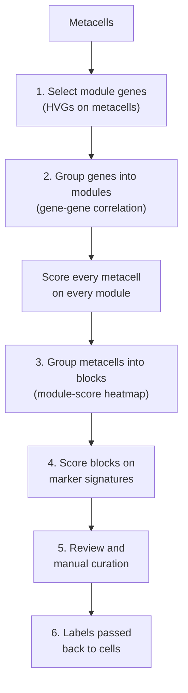
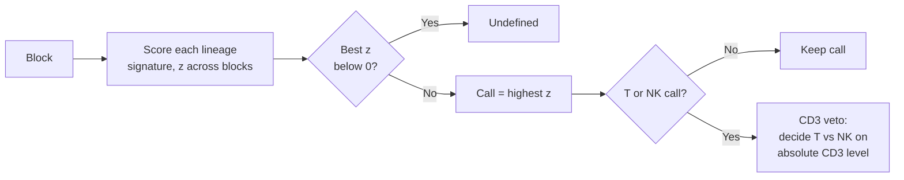
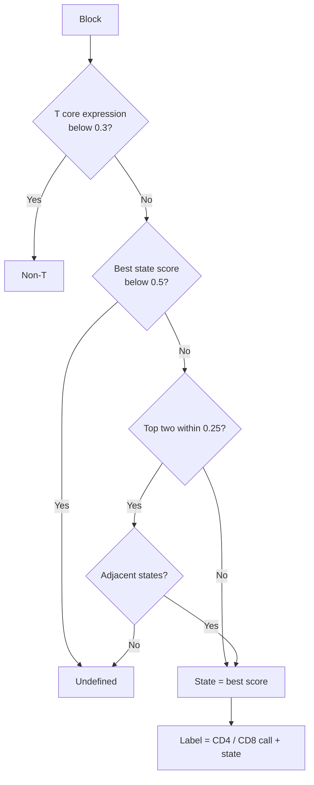

<div align="right">
  <small><em>Author: Saumya Pothukuchi & Claude AI - Opus 4.8 (Anthropic, 2026)</em></small>
</div>

# Annotation

* Scripts 02 and 04 produced metacells ([04](04_building_metacells.md)). They have no labels yet: just thousands of deep expression profiles.
* This page covers scripts **03** (global) and **05** (subset), which turn those metacells into cell type or cell state labels.
* The labels then flow two ways:
  * Global labels (`broad_label`) decide which cells enter each subset ([08](08_two_passes.md)).
  * Subset labels (`cluster_label`) are what composition, DE, GSEA and clonal analyses are run on ([09](09_composition.md) onwards).

### Compared with a traditional workflow

| Traditional (Seurat) | This pipeline | What changes |
|:--|:--|:--|
| HVGs | Module HVGs on metacells ([06](06_parameters.md), HVG thresholds) | Same idea, on metacells |
| PCA, then clustering cells | Genes grouped into **modules**, metacells grouped into **blocks** | Groups are defined by gene programs, not by position in PCA space |
| `FindAllMarkers`, read by eye | Marker **signatures scored on blocks**, with rules for ambiguous calls | The call is reproducible and every score is recorded |
| Rename clusters by hand | **Manual overrides** layered on top of the automatic call | Both the automatic and curated labels are kept |



## Why modules rather than markers directly

* The simple approach would be to score each metacell on a marker panel and take the highest score. That works badly for two reasons:
  * **A single metacell is still noisy enough** that one marker dropping out can flip its call.
  * **A marker panel only finds what someone already thought to look for.** A state nobody listed a marker for gets forced into the nearest known label.
* Modules are found from the data instead. Genes that rise and fall together across metacells are grouped into modules, and metacells are grouped by which modules they express.
* Marker signatures are then applied to **blocks** (groups of tens to hundreds of metacells), whose averages are far more stable than single metacells.
* An unexpected program still shows up as a module, even with no marker to name it. That is a lead to follow up, rather than a silent miss.

## 1. Selecting module genes

* Genes are selected on a mean-dispersion plot, as described in [06](06_parameters.md) (HVG thresholds), including how to tune both thresholds.
* Lateral and noisy genes are then removed from the selection ([05](05_gene_lists.md)). The drop is proportionally larger on a subset (global: 2,096 to 1,986; T cell subset: 2,134 to 1,981), because TCR V/J and ribosomal genes make up more of the most variable genes once differences between lineages are gone.

## 2. Modules

### Grouping genes

Genes are grouped in four steps:

1. **Correlation.** Pearson correlation between every pair of selected genes, across metacells.
2. **Distance.** Euclidean distance between rows of that correlation matrix.
3. **Clustering.** Hierarchical clustering (complete linkage) on those distances.
4. **Cutting.** The gene tree is cut into `NCLUST` modules (100 global, 90 subset; [06](06_parameters.md)).

**Why distance on the correlation matrix, not on expression.**
* Step 2 compares genes by their **whole correlation profile**: how each correlates with every other gene. Two genes are close if they correlate similarly with everything else, even if they are only moderately correlated with each other.
* *Example:* *GZMB* and *PRF1* may correlate only moderately with each other in a given dataset, because of dropout. But both correlate strongly with *GNLY*, *NKG7* and *FGFBP2*, and weakly with *CCR7* and *LEF1*. Their profiles match, so they land in the same cytotoxic module.

### Scoring metacells on modules

* For each metacell and each module: the metacell's total log-expression of that module's genes, divided by its total log-expression of all genes. This is the **fraction of the metacell's expression attributable to the module**.
* Each module's scores are then **z-scored across metacells**, so modules of different sizes and expression levels are comparable. A z of +2 means the metacell expresses that module much more than a typical metacell does.
* *Example:* if a B cell module accounts for 2% of one metacell's log-expression, while the average metacell has 0.3%, that metacell scores high on the module; T cell metacells score below zero.

## 3. Blocks

### Building the heatmap

* The module scores form a matrix of **modules (rows) x metacells (columns)**, drawn as a ComplexHeatmap.
* The columns are split into `column_km` groups by k-means (40 global, 25 subset; [06](06_parameters.md), Number of blocks). Each group is a **block**: metacells running the same combination of modules.
* A block is the metacell equivalent of a cluster, and is what gets annotated.
* `set.seed(42)` is set before drawing, because k-means starts randomly; without it, block numbers change between runs.


*Global run: 100 modules (rows) by 6,902 metacells (columns), split into 40 blocks. Each vertical band is a block; red marks modules that block expresses highly.*

### Reading which modules drive each block

* `blockmeans` is a **module x block** table of mean z-scores. The script prints the **top five modules for each block**.
* This is the table to read when a block's label looks wrong: it shows which programs the block is actually running, independent of any marker list.
* Both tables are written to the `*_module_block_map_*.xlsx` workbook:

| Tab | Contents |
|:--|:--|
| `modules_genes` | Every module and its full gene list |
| `block_module_ranking` | For each block, all modules ranked by mean z |
| `block_celltype_mapping` | Written in step 4: each block's label, scores and top module |

**The small block check (subset only).** Script 05 prints any block with fewer than 10 metacells. Blocks that small give unstable signature scores in the next step; if several appear, lower the block count and rerun ([06](06_parameters.md)).

## 4. Scoring blocks

### Two gene lists per label

* **`panel`** is displayed on the annotation heatmap. It is generous, and includes markers shared between cell types, so a reader can sanity-check calls by eye.
* **`sig`** is what is actually scored. Each gene appears in only one signature.
* Genes that a reference such as Azimuth PBMC L2 lists under two different subsets (e.g. `IL7R`, `KLRB1`, `NKG7`, `CCL5`, `KLRD1`, `CTLA4`, `EOMES`) are **display-only**. If a gene cannot separate two states in the reference, it will not separate them here, and scoring it adds noise to both.
* Some genes are left out for being too broadly expressed, even when they are textbook markers. For example, the global NK signature excludes `TYROBP` and `KLRD1`, which are also high in monocytes.

### Expression per block

* For each block, expression of every signature gene is averaged across its metacells (log-normalised, CP10K).
* From here, the global and subset scripts score differently, because the question differs: **global** separates lineages that differ strongly, while **subset** separates states within one lineage that differ subtly.

| | Global (script 03) | Subset (script 05) |
|:--|:--|:--|
| Question | Which lineage? | Which state, and CD4 or CD8? |
| Scoring | Mean expression per signature, then z-scored across blocks per signature | Each gene z-scored across blocks first, then averaged per signature |
| Undefined when | Best z below 0 | Best score below `BEST_MIN` (0.5), or two unrelated states within `MARGIN_MIN` (0.25) |
| Lineage check | CD3 veto (T vs NK) | T core expression below `TCORE_ABS_MIN` (0.3) = `Non-T` |
| Extra axis | None | CD4 vs CD8, scored separately |

### Global scoring (script 03)

* Each block gets one score per lineage signature, which is z-scored across blocks. The call is the lineage with the highest z.
* If even the best z is below 0, nothing fits better than average, and the block is `Undefined`.

**The CD3 veto.** T and NK cells share much of a cytotoxic program, so a relative score cannot reliably separate them. The boundary is instead decided on absolute CD3 expression (log-CP10K), in both directions:

```r
CD3_MIN <- 1.0
bad_T  <- call == "T cells" & (cd3 < CD3_MIN | nk > cd3)   # T call without CD3 support
bad_NK <- call == "NK"      & cd3 >= CD3_MIN & cd3 > nk    # NK call with clear CD3
```

* A T call without CD3 support becomes NK if NK markers are clearly present, otherwise `Undefined`.
* An NK call with clear CD3 expression becomes T cells.
* Settling this at block level means the subset step does not have to re-decide it.




### Subset scoring (script 05)

**Why the order of operations changes.**
* If raw expression is averaged within a signature, one highly expressed gene can carry the whole signature. In an early version, `HLA-DRA` alone defined the activation signature.
* So each gene is first z-scored across blocks, then genes are averaged per signature, giving each gene equal weight.
* Genes are **centred on the median** block rather than the mean. Blocks are not balanced across states: with 10 naive blocks out of 25, the mean of *CCR7* sits inside the naive population, and naive blocks would score about 0 on their own markers. The median is not pulled by the dominant state.

**The call rules.**
* The call is the highest-scoring state, subject to:
  * **Best score below `BEST_MIN` (0.5)** becomes `Undefined`: nothing fits.
  * **Top two within `MARGIN_MIN` (0.25)** becomes `Undefined`: two unrelated states fit equally well.
  * **Adjacent pairs are exempt from the margin rule.** Some states share a program and legitimately tie, e.g. Innate-like with Temra/Cytotox, or Temra/Cytotox with Tem/GZMK. A near-tie between them is overlap, not ambiguity, and the higher score wins. Without this, gamma-delta and NKT-like blocks land in `Undefined` against a cytotoxic signature they genuinely resemble.
* **T core check.** A block with mean T core expression (`CD3D`, `CD3E`, `CD3G`, `TRAC`, `TRBC2`) below `TCORE_ABS_MIN` (0.3, log-CP10K) is labelled `Non-T`. The threshold is absolute and matches the T cell floor in the purity gate ([08](08_two_passes.md)), so the two scripts agree by construction.

**CD4 vs CD8 as a separate axis.**
* CD4/CD8 is scored separately from state, and only compared between the two.
* If it were part of the main call, every CD8 block would be labelled "CD8", regardless of whether it is naive, GZMK+ or Temra.
* The final label combines both, e.g. `CD8 Temra/Cytotox`. When the CD4 and CD8 scores are too close to separate, the block is `CD4/CD8-amb`.




*T cell subset annotation heatmap: block numbers along the bottom, state calls along the top.*

## 5. Reviewing the calls

* Both scripts print a diagnostic table for every block: its call, best score, margin to the second-best call, and the lineage check value (CD3 / T core).
* The same values are written to `block_celltype_mapping` in the workbook, so each label can be traced to the numbers behind it.
* Blocks to look at first:
  * **Low margin:** two calls nearly tied. Script 04 flags global blocks within 0.5 z of their second call before subsetting ([08](08_two_passes.md)).
  * **`Undefined`:** check the top modules. A real population can land here if its markers were mostly lateral, or dropped out.
  * **A call that contradicts the top modules:** e.g. a block called Mo/Macs whose top module is a neutrophil program.

## 6. Manual curation

Automatic calls are sometimes wrong. The scripts allow corrections without losing the audit trail: the automatic call is always kept, and every override is recorded.

| Level | Where | Override | Kept alongside |
|:--|:--|:--|:--|
| Global block | Script 03 | `BLOCK_RELABEL` | `block_anno` (automatic), `block_anno_final` (curated), `label_source` column |
| Global block or single metacell | Script 04, before subsetting | `BLOCK_RELABEL`, `MC_RELABEL` | `broad_label_original`, `relabel_source`, `manual_relabels` sheet in the QC workbook |
| Subset block | Script 05 | `BLOCK_STATE_OVERRIDE` | `state_auto`, `manual_override` columns |

* The global overrides in 03 and 04 must be kept in sync, since 04 decides which cells enter each subset.
* After changing a global override, rerun the last three chunks of script 03 so the workbook and annotated object are updated.

**What justifies a relabel.** One of:
* The block's top modules clearly name a program the signature missed.
* A defining marker is present, but the score failed for a technical reason (e.g. dropout in resting cells).

Write the reason as a comment next to each entry. A hand-curated label is a methods decision and has to be reportable. From the global V3 run:

```r
BLOCK_RELABEL <- c(
  "7" = "T cells",       # naive/CM CD4 modules (CD28, ICOS, ITK, THEMIS); scored ~0 from CD3 dropout
  "5" = "Granulocytes",  # neutrophil module (CD177, ALPL, CYP4F3); signature was mast/basophil only
  "1" = "MK/Ery"         # MK (P2RY12, RGS18, NFE2) + erythroid modules; called on GATA2 alone
)
```

> [!WARNING]
> Do not relabel `Undefined` blocks wholesale, and do not relabel borderline blocks to pull more cells into a subset. If nothing scored well, the honest reading is that the block has no confident identity, and a contaminated subset hurts downstream results more than a slightly smaller one.

## 7. From blocks back to cells

* Every metacell inherits its block's label, and every cell inherits its metacell's label.
* Cells MC2 left as outliers ([04](04_building_metacells.md)) get `Outlier`. Metacells missing from the heatmap get `Unassigned`; this count should be 0.
* The script prints a summary of cells per label, including outliers, unassigned and `Undefined`.

| Output | Contents |
|:--|:--|
| `*_module_block_map_*.xlsx` | Modules, block rankings, block labels and scores |
| `*_metacell_block_annotations.csv` | One row per metacell: block and label (`broad_label` globally; `cluster_label`, `mc_state`, `mc_cd4cd8` on a subset) |
| `*_MC_annotated.RDS` | Cell-level Seurat object with block, label and annotation scores per cell |
